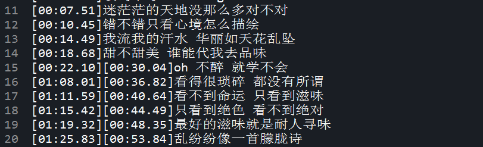

# 关于项目
> 该项目基于HTML5 audio api 完成的一个分享版简易音乐播放器。

### 关于歌词
Lrc歌词文件：大部分MP3显示歌词的方法使用的是lrc格式的歌词文件，也是当前网络上最流行的一种歌词格式。LRC通常有合并和展开两种形式：合并LRC歌词是将歌词内容相同的合并起来，多个时间标签对应一句歌词；展开LRC是一个时间标签对应一句歌词。合并LRC可以节省磁盘空间。



### 解析歌词
```
parseLyric: function(text){
	//将文本分隔成一行一行，存入数组
    var lines = text.split('\n'),
        //用于匹配时间的正则表达式，匹配的结果类似[xx:xx.xx]
        pattern = /\[\d{2}:\d{2}.\d{2}\]/g,
        //保存最终结果的数组
        result = [];
    //去掉不含时间的行
    while (!pattern.test(lines[0])) {
        lines = lines.slice(1);
    };
    //上面用'\n'生成生成数组时，结果中最后一个为空元素，这里将去掉
    lines[lines.length - 1].length === 0 && lines.pop();
    lines.forEach(function(v /*数组元素值*/ , i /*元素索引*/ , a /*数组本身*/ ) {
        //提取出时间[xx:xx.xx]
        var time = v.match(pattern),
            //提取歌词
            value = v.replace(pattern, '');
        //因为一行里面可能有多个时间，所以time有可能是[xx:xx.xx][xx:xx.xx][xx:xx.xx]的形式，需要进一步分隔
        time.forEach(function(v1, i1, a1) {
            //去掉时间里的中括号得到xx:xx.xx
            var t = v1.slice(1, -1).split(':');
            //将结果压入最终数组
            result.push([parseInt(t[0], 10) * 60 + parseFloat(t[1]), value]);
        });
    });
    //最后将结果数组中的元素按时间大小排序，以便保存之后正常显示歌词
    result.sort(function(a, b) {
        return a[0] - b[0];
    });
    return result;
}
```
### 同步歌词
```
var lyric = []; //歌词结果数组
this.audio.addEventListener('timeupdate', function(){
	var curTime = this.currentTime;				
	lyric.forEach(function(v, i){
		if (curTime > v[0]) { // 当前时间大于歌词对应的时间，高亮显示歌词
			$('#line-'+ (i>0 ? i-1 : i)).classList.remove('current');
			$('#line-'+ i).classList.add('current');  // 设置当前歌词样式
			$lyric.style.transform = 'translate3d(0,-'+ 42*i +'px,0)'; // 每行歌词行高是42px
		}
	});
});
```

### audio api
- 属性
1. currentTime	设置或返回音频/视频中的当前播放位置（以秒计）
2. duration		返回当前音频/视频的长度（以秒计）

- 事件
1. canplay	当浏览器可以播放音频/视频时
2. play		当音频/视频已开始或不再暂停时
3. ended	当目前的播放列表已结束时
4. timeupdate	当目前的播放位置已更改时

- [参考地址](http://www.w3school.com.cn/tags/html_ref_audio_video_dom.asp)

### 项目预览
```
1. npm install
2. npm run dev
```
- [源码](https://github.com/leyou319/html5_audio)
- [本地预览](http://localhost:8080/)
- [线上预览](https://leyou319.github.io/html5_audio/)
